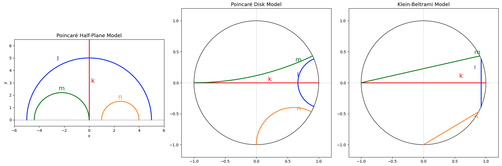

# Poincare Half-plane vs Poincare Disk vs Klein-Beltrami Disk models

  

In the Klein-Beltrami model for the hyperbolic plane, the shortest paths (geodesics), are chords (labeled k, l, m, n, are shown). In the Poincaré disk model, geodesics are portions of circles that intersect the boundary of the disk at right angles, and in the Poincaré upper half-plane model, geodesics are semicircles with their centres on the boundary.  
  
To plot, use the following code, [View `poincare.py`](Python/poincare.py). 
